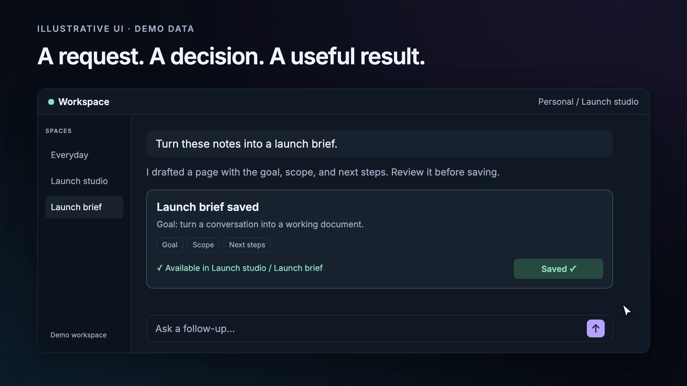
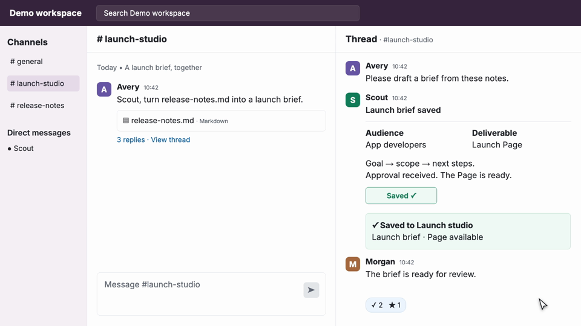
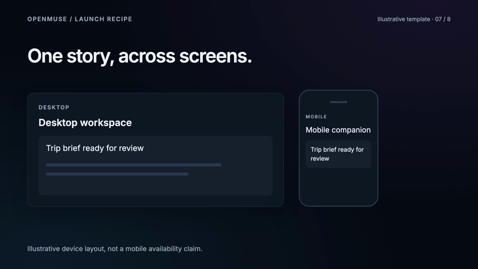
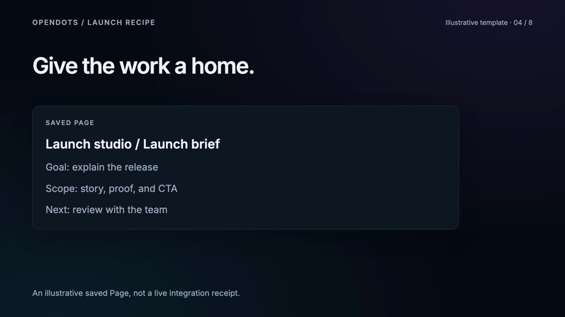

# Demo skills

Make developer-focused launch films and animated product UI with Claude Code, Codex, or another agent that reads `SKILL.md` files.

Three practical skills, extracted from work on the local **gtm-os** video library. They cover the whole job: inspect references, establish the story, build or record the visuals, render, review, and deliver editable assets.

| Skill | Use it for |
| --- | --- |
| [launch-video](skills/launch-video/SKILL.md) | A product launch film with a hook, product proof, diagrams, real recordings, audio, and a useful CTA |
| [slack-demo-video](skills/slack-demo-video/SKILL.md) | Editable Slack channels and threads with progress, approvals, Block Kit-style results, and clean editor footage |
| [ui-mockup-video](skills/ui-mockup-video/SKILL.md) | An animated app interface: typing, streaming, tool calls, approval, cards, navigation, and visible results |



## Give these to Claude

```sh
git clone https://github.com/jerelvelarde/demo-skills.git
cd demo-skills
python3 scripts/install.py --agent claude
```

This installs all three skills into `~/.claude/skills`, including the supporting `gtm-os` files. It refuses to replace an existing skill. Start a new Claude Code session, then ask:

```text
Use /launch-video to make a 40-second product launch video.
Here is the working app, the brand guide, and the three claims to demonstrate: …
Keep the source editable and deliver the MP4 plus an editor handoff.
```

```text
Use /ui-mockup-video to animate this app screenshot into a 12-second demo.
Show a request, a streamed response, an approval, and the resulting saved page.
Use illustrative demo data and keep the UI readable on a phone.
```

For Codex: `python3 scripts/install.py --agent codex` installs into `~/.agents/skills`; invoke `$launch-video`, `$ui-mockup-video`, or `$slack-demo-video`. To use a project-specific location, pass `--dest /path/to/project/.claude/skills` (or `.agents/skills`). Preview any install with `--dry-run`. Other agents can read the three skill files directly.

## Render the example

[gtm-os](gtm-os/README.md) contains a portable production workspace and a working Remotion starter, not a copy of the original multi-gigabyte video archive.

Requires Node.js 22+, npm, Python 3.10+, and FFmpeg/ffprobe for export verification. Remotion can download its rendering browser on first use.

```sh
cd gtm-os/remotion-starter
npm ci
npm run typecheck
npm run studio
# In another terminal, in this same directory:
npm run render:launch
npm run render:ui
npm run render:slack
npm run render:openmuse
npm run render:opendots
npm run review -- SlackThread OpenMuseLaunch OpenDotsLaunch
npm run render:4k
npm run poster
```

The six compositions are `Launch` (24 seconds), `UiMockup` (12 seconds), `DiagramLoop` (8 seconds), `SlackThread` (18 seconds), `OpenMuseLaunch` (36 seconds), and `OpenDotsLaunch` (32 seconds), all at 30 fps. Output goes to `out/`. The example is silent and uses fictional data; the launch skill explains how to add a licensed or original soundtrack and real product footage.

## Studio examples and source

The starter includes [Studio configuration](gtm-os/remotion-starter/remotion.config.ts), a [shared composition registry](gtm-os/remotion-starter/compositions.json), [Slack UI source](gtm-os/remotion-starter/src/SlackThread.tsx), and [product story schedules](gtm-os/remotion-starter/src/product-stories.ts). The [Studio workflow guide](skills/launch-video/references/studio-workflow.md) maps every composition to its active files and commands.

`SlackThread` defaults to clean full-frame UI. Set `clean` to false in Studio input props for a presentation wrapper with disclosure. Render clean 4K/ProRes with `npm run render:slack:4k` / `npm run render:slack:prores`. These authored messages and receipts are illustrations; the clip does not call Slack APIs. Clean footage retains its disclosure in editor notes.

The [OpenMuse](skills/launch-video/references/openmuse-recipe.md) and [OpenDots](skills/launch-video/references/opendots-recipe.md) recipes carry over story, evidence, capture, and editor practices. Their runnable examples use synthetic UI and neutral artwork. OpenDots' original launch film used Canvas; its Remotion composition is a new adaptation. Replace CTA placeholders and verify claims before using either template for a public film.

| Slack thread | OpenMuse recipe | OpenDots recipe |
| --- | --- | --- |
|  |  |  |

Example request: `Use $slack-demo-video to make an 18-second clean Slack thread demo with a request, draft approval, saved Page receipt, and an editor handoff. Use synthetic content.`

## What carries over from the production work

- Readable UI starts with the app: enlarge its text and components **before recording**. A 150% crop of tiny recorded UI is a different operation.
- One visual system across scenes: typography, surface colors, spacing, icon treatment, and motion timing.
- Causal interaction: the click precedes the state change; an approval precedes the success receipt.
- Stable diagrams: connector endpoints come from the same node geometry; movement follows those exact paths.
- Frame-based animation, locally bundled assets, a lockfile, and reproducible render commands.
- Honest media labels: actual recordings, illustrative mockups, native raster resolution, and upscaled editor copies stay distinguishable.
- Visual review of the actual export, including transitions, frame 0, small text, and the closing CTA.

See [reference notes](docs/reference-notes.md), [validation](docs/validation.md), and [provenance](PROVENANCE.md). No original launch footage, private conversations, credentials, customer data, or proprietary brand assets are bundled.

## License

The newly authored skills, documentation, and starter code are MIT licensed. Dependencies have their own licenses. In particular, using the Remotion runtime is governed by [Remotion's license](https://www.remotion.dev/license); this repository's MIT license does not replace it. Inter is supplied by the pinned `@fontsource/inter` package under its included OFL license.
